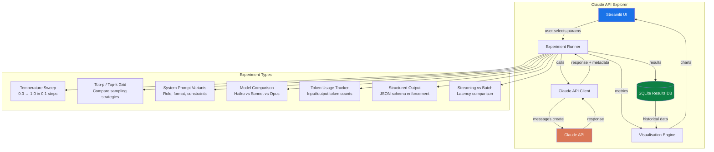

# Project 1: Claude API Explorer

> A Python application that systematically tests and visualises every Claude API parameter, giving you deep intuition for how the API works and content for 3-5 posts.

## Employer Skills Demonstrated

| Skill | How |
|-------|-----|
| **S1: Specification Precision** | You'll learn exactly how parameter choices change output — the foundation of precise specs |
| **S4: Failure Pattern Recognition** | You'll see how bad parameter combos cause failures (too low temp + strict format = repetition) |
| **S7: Cost & Token Economics** | You'll measure token usage across models and parameters — real cost data |

## Interview Questions This Covers

- What is temperature, and how does it affect output?
- Explain Top-p and Top-k sampling. How do they differ?
- What are logits, and how are they used in text generation?
- What is the context window in LLMs, and why does it matter?
- What is a system prompt, and how does it influence model behaviour?
- How do you optimize prompts for cost and latency?
- Your LLM generates responses that are too verbose. How do you control response length?
- What is the difference between open-source and closed-source LLMs?
- How do you implement streaming responses for real-time AI applications?
- What is KV cache, and how does it speed up inference?

## Architecture



## Tech Stack

| Component | Package | Purpose |
|-----------|---------|---------|
| LLM Client | `anthropic` | Official Anthropic Python SDK |
| UI | `streamlit` | Interactive web UI for experiments |
| Database | `sqlite3` (stdlib) | Store experiment results |
| Visualisation | `plotly` | Interactive charts |
| Data | `pandas` | Tabular data manipulation |
| Config | `pydantic` | Type-safe experiment configs |
| Environment | `python-dotenv` | API key management |

## Repo Structure

```
claude-api-explorer/
├── README.md                    # Project overview, setup, screenshots
├── requirements.txt             # pip dependencies
├── .env.example                 # ANTHROPIC_API_KEY=your-key-here
├── pyproject.toml               # Project metadata
│
├── src/
│   ├── __init__.py
│   ├── client.py                # Claude API wrapper with retry/error handling
│   ├── experiments/
│   │   ├── __init__.py
│   │   ├── base.py              # BaseExperiment class
│   │   ├── temperature.py       # Temperature sweep experiment
│   │   ├── sampling.py          # Top-p / Top-k grid experiment
│   │   ├── system_prompts.py    # System prompt variant testing
│   │   ├── model_compare.py     # Cross-model comparison
│   │   ├── token_tracking.py    # Token usage measurement
│   │   ├── structured_output.py # JSON/XML output enforcement
│   │   └── streaming.py         # Streaming vs batch latency
│   │
│   ├── storage.py               # SQLite storage for results
│   ├── visualisation.py         # Plotly chart generators
│   └── config.py                # Pydantic models for experiment configs
│
├── app.py                       # Streamlit entry point
│
├── data/
│   └── results.db               # SQLite database (gitignored)
│
├── notebooks/
│   └── exploration.ipynb        # Jupyter notebook for ad-hoc analysis
│
└── tests/
    ├── test_client.py
    ├── test_experiments.py
    └── test_storage.py
```

## Step-by-Step Implementation

### Phase 1: Core API Client (Day 1)

1. **Set up the project skeleton**
   ```bash
   mkdir claude-api-explorer && cd claude-api-explorer
   python -m venv venv && source venv/bin/activate
   pip install anthropic streamlit plotly pandas pydantic python-dotenv
   ```

2. **Build `src/client.py`** — a wrapper around the Anthropic SDK
   - Initialise client from env var `ANTHROPIC_API_KEY`
   - Add a `call()` method that takes model, system prompt, messages, and all generation params
   - Return a structured result: response text, input tokens, output tokens, latency, model, params used
   - Add retry logic with exponential backoff for rate limits
   - Add streaming support via `client.messages.stream()`
   - **Key learning**: understand the `messages.create()` API shape — `model`, `max_tokens`, `temperature`, `top_p`, `top_k`, `system`, `messages`

3. **Build `src/config.py`** — Pydantic models
   ```python
   class ExperimentConfig(BaseModel):
       name: str
       model: str = "claude-sonnet-4-20250514"
       prompt: str
       system_prompt: str = ""
       num_runs: int = 3  # repeat for consistency
       temperature: float | None = None
       top_p: float | None = None
       top_k: int | None = None
       max_tokens: int = 1024
   ```

4. **Build `src/storage.py`** — SQLite storage
   - Create table: `experiments(id, name, timestamp, config_json, results_json)`
   - Methods: `save_result()`, `get_results(experiment_name)`, `get_all()`

### Phase 2: Experiment Engine (Days 2-3)

5. **Build `src/experiments/base.py`** — BaseExperiment class
   ```python
   class BaseExperiment:
       def __init__(self, client, storage, config):
           self.client = client
           self.storage = storage
           self.config = config

       def run(self) -> list[ExperimentResult]:
           """Override in subclasses"""
           raise NotImplementedError

       def run_single(self, **overrides) -> ExperimentResult:
           """Run one API call with optional param overrides"""
           # merge config with overrides, call client, time it, return result
   ```

6. **Build each experiment module** (one per file):

   **`temperature.py`** — Temperature Sweep
   - Run the same prompt at temperature 0.0, 0.1, 0.2 ... 1.0
   - For each temperature, run 3 times to measure consistency
   - Collect: response text, token count, self-similarity score between runs
   - **Key insight to document**: at temp 0.0, outputs are nearly deterministic; above 0.7, creativity rises but consistency drops

   **`sampling.py`** — Top-p / Top-k Grid
   - Create a grid: top_p [0.1, 0.3, 0.5, 0.7, 0.9, 1.0] × top_k [1, 5, 10, 50, 100, 250]
   - Run same prompt at each combination
   - Measure output diversity and quality
   - **Key insight**: top_p and top_k interact — using both narrows the distribution more than either alone

   **`system_prompts.py`** — System Prompt Testing
   - Define 5+ system prompt variants: no system prompt, short role, detailed role, format constraints, persona + constraints
   - Run same user message with each variant
   - Compare output structure, tone, length, adherence to format
   - **Key insight**: system prompts are the most powerful and underused lever

   **`model_compare.py`** — Cross-Model Comparison
   - Run same prompts on Haiku, Sonnet, Opus
   - Measure: quality (manual + LLM-as-judge), latency, token usage, cost
   - Create a cost-per-quality-point metric
   - **Key insight**: Haiku is often sufficient for classification/formatting; Opus shines on reasoning

   **`token_tracking.py`** — Token Usage Analysis
   - Measure input vs output tokens for various prompt lengths
   - Track how system prompt length affects total tokens
   - Calculate cost per request for each model
   - Build a simple cost calculator
   - **Key insight**: system prompts are cached after first use (prompt caching) — measure the difference

   **`structured_output.py`** — Structured Output Enforcement
   - Test JSON output with and without explicit schema in the prompt
   - Test XML output formatting
   - Measure parse success rate across temperatures
   - **Key insight**: lower temperature + explicit schema = near 100% valid JSON

   **`streaming.py`** — Streaming vs Batch
   - Compare time-to-first-token (TTFT) vs total completion time
   - Measure perceived latency with streaming
   - **Key insight**: streaming doesn't change total time but dramatically improves user experience

### Phase 3: Visualisation & UI (Days 4-5)

7. **Build `src/visualisation.py`** — chart generators using Plotly
   - `plot_temperature_sweep()` — line chart: temperature vs consistency/creativity
   - `plot_sampling_grid()` — heatmap: top_p × top_k vs output diversity
   - `plot_model_comparison()` — grouped bar chart: quality, speed, cost per model
   - `plot_token_usage()` — stacked bar: input vs output tokens
   - `plot_cost_breakdown()` — pie/bar chart: cost by model and experiment type

8. **Build `app.py`** — Streamlit UI
   - Sidebar: select experiment type, configure parameters
   - Main area: run experiment, show results, display charts
   - History tab: view past experiments from SQLite
   - Export: download results as CSV

### Phase 4: Polish & Document (Day 6)

9. **Write a comprehensive README.md**
   - Project description and motivation
   - Setup instructions (clone, env, install, run)
   - Screenshots of the Streamlit UI
   - Key findings summary with charts
   - Link to your blog post / X thread about what you found

10. **Add tests** — at minimum:
    - Test that client handles rate limits gracefully
    - Test that storage saves and retrieves correctly
    - Test that each experiment produces expected result structure

## Key Concepts to Study While Building

| Concept | Why It Matters | Where You'll Hit It |
|---------|---------------|-------------------|
| Tokenization | Understanding how text becomes tokens affects cost and context limits | Token tracking experiment |
| Sampling strategies | Temperature, top-p, top-k control output randomness | Temperature + sampling experiments |
| System prompts | The most powerful way to control Claude's behaviour | System prompt experiment |
| Streaming | Essential for any user-facing application | Streaming experiment |
| Prompt caching | Can dramatically reduce costs for repeated system prompts | Token tracking experiment |
| Model selection | Different models suit different tasks and budgets | Model comparison experiment |

## Definition of Done

- [ ] All 7 experiments run and produce results
- [ ] Streamlit UI works locally with interactive parameter controls
- [ ] SQLite database stores all experiment results
- [ ] At least 3 Plotly charts showing key findings
- [ ] README with setup instructions, screenshots, and key findings
- [ ] Tests passing for core modules
- [ ] You can confidently explain temperature, top-p, top-k, system prompts, streaming, and token economics in an interview
- [ ] You have 3-5 draft posts from your findings

## Content Angles

| Post | Hook | Platform |
|------|------|----------|
| Parameter deep dive | "I tested every Claude API parameter so you don't have to" | X thread |
| Model comparison | "Haiku vs Sonnet vs Opus: when to use which (with real data)" | LinkedIn |
| Cost breakdown | "Here's exactly how much each Claude model costs per task type" | X thread |
| System prompt power | "Your system prompt is doing 10% of what it could. Here's proof." | X thread |
| Streaming explained | "Why streaming doesn't make Claude faster (but makes your app feel instant)" | X |